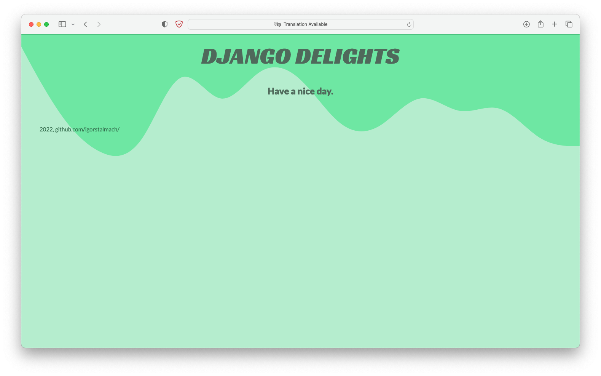

# Django Delights
## A Codecademy final Django project, from "[Build Python Web Apps with Django](https://www.codecademy.com/learn/paths/build-python-web-apps-with-django)" Skill Path

### Features
- User login
- Ability to add, remove, and change recipes with its ingredients, purchases made in the restaurant and a total of stored ingredients in storage
- Earnings calculation
- Homepage with a summary of added items
- Intuitive UI

### Technologies
- Python 3.10.6
- Django 4.1

### Screenshots
#### A list of every stored ingredient 

#### Updating an ingredient

#### A list of recipes, with included changeable requirements

#### Login and logout screen

